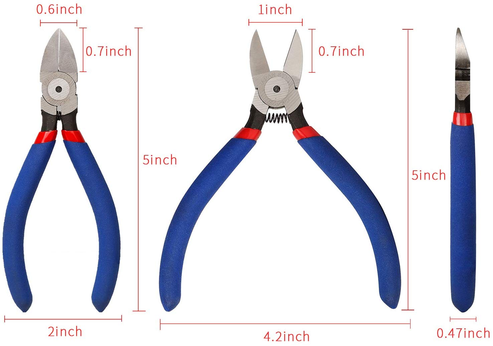

# Components

| **Component**       | **Model**     | **Image**                                                                                                                                                            | **Notes**                                                                                                                                                                                                                                                      |
|---------------------|---------------|----------------------------------------------------------------------------------------------------------------------------------------------------------------------|----------------------------------------------------------------------------------------------------------------------------------------------------------------------------------------------------------------------------------------------------------------|
| Case                | *TBD*         |                                                                                                                                                                      | Bigger is better, really. More space for ambient air cooling, easier to work in, prettier when it's not cluttered.                                                                                                                                             |
| Power Supply        | *TBD*         |                                                                                                                                                                      | Spring for a "fully modular" PSU, which will let you remove power cables you don't need. In practice, most are unusued. Choose capacity by adding TDP of CPU, GPU, pump, fans, and adding a healthy amount of headroom. Overcapacity is better than under!     |
| Motherboard         | *TBD*         |                                                                                                                                                                      | Verify compatibility w/CPU socket and RAM spec. Make sure fan headers support PWM (many have a dual PWM/DC mode you can toggle from BIOS).                                                                                                                     |
| CPU                 | *TBD*         |                                                                                                                                                                      |                                                                                                                                                                                                                                                                |
| GPU                 | *TBD*         |                                                                                                                                                                      |                                                                                                                                                                                                                                                                |
| RAM                 | *TBD*         |                                                                                                                                                                      | Buy in pairs, stick with the same model for everything.                                                                                                                                                                                                        |
| Fast storage        | *TBD*         |                                                                                                                                                                      | Motherboard-socketed NVMe storage is fastest thing on market. Put games on this storage device to minimize loadtimes, and put OS/etc on "slower" SSD or mass storage.                                                                                          |
| Mass storage        | *TBD*         |                                                                                                                                                                      | Or also an NVMe-only build is practical! You might skip SSDs/HDDs altogether, and not have to run *any* SATA power + data cables for a super clean build.                                                                                                      |
| Case fans           | *TBD*         |                                                                                                                                                                      | Bigger radius = more airflow at given RPM (and thus sound level). You want a buncha big, slow fans. Get PWM-controlled instead of DC-controlled.                                                                                                               |
| Radiator fans       | *TBD*         |                                                                                                                                                                      | If you have a choice, go with "high static pressure" instead of "high airflow." But otherwise same advice stands as for case fan: big + slow.                                                                                                                  |
| Fan controller      | *TBD*         |  | You'll probably end up having more fans than motherboard fan headers. A controller lets you signal multiple fans from same header. Gotta be PWM instead of DC as well.                                                                                         |
| Reservoir           | *TBD*         |                                                                                                                                                                      | Needs to be compatible with pump. Typically, reservoir drains directly into pump, and often you can buy the two as a package.                                                                                                                                  |
| Pump                | *TBD*         |                                                                                                                                                                      |                                                                                                                                                                                                                                                                |
| Radiator            | *TBD*         |                                                                                                                                                                      | Bigger = more cooling capacity. Fans mount directly to radiator to force air through fins; tight fin spacing means high static pressure gradient, which can influence fan choice.                                                                              |
| CPU water block     | *TBD*         |                                                                                                                                                                      | Replaces stock air cooler mounted on top of CPU. Presses metal plate tightly against CPU's IHS, flushes coolant across other side of that plate. Presents compression fittings.                                                                                |
| GPU water block     | *TBD*         |                                                                                                                                                                      | Replaces housing of GPU, presses a metal plate tightly against hot GPU components, flushes coolant across other side of that plate. Presents compression fittings.                                                                                             |

# Fittings + Plumbing

| **Fitting** | **Model** | **Image** | **Notes** |
|-------------|-----------|-----------|-----------|
| T joint     |           |           |           |
| Spigot      |           |           |           |
| Fill port   |           |           |           |
| Drain port  |           |           |           |

# Tools

| **Tool**              | **Purpose**                             | **Image**                                                                                                                                                                                           | **Chinigo has?**   | **Notes**                                                                                                                                            |
|-----------------------|-----------------------------------------|-----------------------------------------------------------------------------------------------------------------------------------------------------------------------------------------------------|--------------------|------------------------------------------------------------------------------------------------------------------------------------------------------|
| Screwdriver           | General purpose                         |                                                                                                                                                                                                     | Y                  | Most screws are Phillips head, but you'll run into the occasional flathead. Magnetized tip are clutch to get screws into and out of tight corners.   |
| Hex sockets           | Motherboard standoffs                   |                                                                                                                                                                                                     | Y                  |                                                                                                                                                      |
| Allen wrenches        | GPU screws, misc case screws            |                                                                                                                                                                                                     | Y                  |                                                                                                                                                      |
| Needle nosed pliers   | Pulling wires, etc                      |                                                                                                                                                                                                     | Y                  |                                                                                                                                                      |
| Paste spreader        | Applying thermal paste to CPU and GPU   |                                 | Y                  |                                                                                                                                                      |
| Plumber's pliers      | Gripping compression fittings           |                       | Y                  |                                                                                                                                                      |
| Tube cutter           | Cutting tubes                           |                                                             | Y                  |                                                                                                                                                      |
| Flush cut snips       | Cutting zip ties                        |  | N                  |                                                                                                                                                      |

# Hardware

| **Hardware**           | **Purpose**                                                 | **Image**                                                  | **Chinigo has?**   | **Notes**                                                                                                                                            |
|------------------------|-------------------------------------------------------------|------------------------------------------------------------|--------------------|------------------------------------------------------------------------------------------------------------------------------------------------------|
| Motherboard standoff   | Supporting NVMe drive                                       |  | Y                  | Likely comes w/the drive.                                                                                                                            |
| Zip ties               | Cable routing                                               |                                                            | Y                  | Get more than you need, you'll end up throwing a bunch away. I like using twist ties to stage everything, and then lock it all down with zip ties.   |
| Various screws         | You'll inevitably find you need some screw you don't have   |                                                            | Y                  | I've got a little kit now, I'll bring it over.                                                                                                       |
| CPU cooler mount       | Squeezes CPU water block against CPU                        |                                                            | N                  | Will likely come with water block.                                                                                                                   |
| CPU air cooler         | Used to test CPU before water cooling loop is complete      |                                                            | N                  | CPU will likely come with stock cooler. (Tho, e.g. my 3950x did not.)                                                                                |

# Supplies
| **Supply**                         | **Purpose**                                                               | **Chinigo has?** | **Notes**                                                                                                                                                                    |
|------------------------------------|---------------------------------------------------------------------------|------------------|------------------------------------------------------------------------------------------------------------------------------------------------------------------------------|
| Thermal paste                      | Ensure good thermal transfer between CPU/GPU's IHS and cooler/water block | Y                | Hopefully you're not slopping enough of it on to short a component, but get a nonconductive one anyhow just to be safe. Spreading the paste is a bit of an art.              |
| Q tips                             | Cleaning thermal paste off chip                                           | Y                | You'll need to strip the thermal paste off at least once – when you temporarily mount the CPU's air cooler, before you've test your GPU water cooling. Also if you screw up. |
| Paper towels                       | Cleaning thermal paste                                                    | N                | Get your own damned paper towels.                                                                                                                                            |
| Rubbing alcohol                    | Cleaning thermal paste                                                    | Y                | Ok, now this I have way too much of. I accidentally bought four cases of rubbing alcohol off Amazon instead of four bottles.                                                 |
| 1 gal distilled water              | Flush loop                                                                | N                |                                                                                                                                                                              |
| Dilute acetic acid (white vinegar) | Flush loop                                                                | N                | For a copper radiator. [Other metals may require different solvents](https://www.ekwb.com/blog/how-to-clean-water-blocks/).                                                  |
| Baking soda                        | Neutralize acetic acid                                                    | N                | Don't want that vinegar hanging around to corrode after your rinse.                                                                                                          |
| 1 gal premixed coolant             | Coolant                                                                   | N                | Don't mix and match: different brands may have incompatible chemistries.                                                                                                     |
| *OR* mix your own!                 | Coolant                                                                   | N                | Distilled water + biocide + anti-corrosive.                                                                                                                                  |

# Steps

## 1. Dry fit
1. Mount all the components in case to get a sense of possible layouts, fan placements, clearances, tube routing, cable routing, etc.

## 2. Core components test
1. Mount motherboard in case
1. Mount CPU
1. Mount air cooler
1. Seat one stick RAM
1. Hook up PSU temporarily
1. Boot test (success = BIOS screen)

## 3. Additional components test
1. Seat NVMe
1. Seat GPU
1. Seat all RAM
1. Mount SSD
1. Run cables
1. Hook up PSU temporarily
1. Boot test with video hooked up to GPU (success = BIOS aware of drives)

## 4. Mount GPU water block
1. Remove factory case, disconnect fan
1. Cut & place thermal pads
1. Spread thermal paste
1. Mount water block
1. Connect compression fittings
1. Seat GPU

## 5. Mount CPU water block
1. Remove air cooler
1. Spread thermal paste
1. Connect compression fittings
1. Mount water block

## 6. Flush radiator
1. Outside of case (or temporarily mounted, whatever's easier), run tubing between radiator and pump/reservoir. Plumb in a T joint, a spigot, and a drain tube.
1. Mount motherboard, CPU w/air cooler, 1 stick RAM.
1. Connect power supply to motherboard, and pump to CPUFAN1.
1. Fill reservoir with dilute acetic acid (5% - 10%). Warm is good, but not necessary: time can substitute for temperature. Def don't want boiling!
1. Boot to BIOS, run pump for an hour or so.
1. Flush loop once with dilute bicarbonate solution to neutralize.
1. Open spigot, drain most fluid with pump (but never run pump dry!!), refill w/distilled water.
1. Flush loop with distilled water until clear (say, 3x). (Never run pump dry!!)
1. Drain loop most of the way with pump. Drain loop completely by tilting and shaking. (Never run pump dry!!)
1. Disconnect everything.

## 7. Cooling system

1. Remove all components except CPU & 1 stick RAM
1. Mount reservoir & pump
1. Screw fill port and drain port into case
1. Mount radiator fans to radiator
1. Mount additional case fans
1. Mount radiator to case
1. Cut & run flex tubing between components. Hand tighten compression fittings only, but tighten them good!
1. Plumb spigot to drain port (if pump has one), or add a T joint in the outlet line (if not).
1. Plumb spigot outlet to drain port.
1. Plumb fill port to top of reservoir.
1. Fill reservoir via fill port.
1. Boot to BIOS. Be ready to add fluid as pump runs: the water level will drop as the fluid in the reservoir gets sucked into the loop.
1. Run pump for a while to confirm no leaks. Note level of coolant in reservoir w/masking tape, drop tissue or construction paper across bottom of case so you'll see any drips. Confirm everything's dry and coolant level hasn't moved after an hour or so.

## 8. Full system test
1. Seat all components again.
1. Run cables. Don't lock them down yet.
1. Connect video output to onboard, disconnect GPU power (you don't want to run it until you can monitor its temp in case you fucked up GPU water block).
1. Boot to BIOS.
1. Configure fan curves from BIOS.
1. Confirm BIOS aware of all components.
1. Keep an eye on CPU temps while you're poking around. They should be nominal, this is as low a load as system will ever encounter.

## 9. Install Windows
1. Install Windows.
1. Install latest Radeon drivers.
1. Install FPSMonitor, copy Chinigo's config.
1. Install passmark or something to generate a buncha CPU and GPU load

## 10. GPU test
1. Connect GPU power, connect video out to GPU.
1. Boot to Windows.
1. Monitor GPU & CPU temps as you run the full Passmark suite. Slam it with load to establish temps under max thermal load.

## 11. Final touches
1. Lock down wiring.

## 12. Overclock GPU
1. I got a 4% overall boost to clock speed without too much effort. Surprisingly straightforward.
1. Confirm temps are acceptable w/increased thermal load due to overclocking.

## 13. Overclock CPU
1. GPU is likely the bottleneck for most graphically-intensive games, but why not OC the CPU too? You've got oodles of cooling capacity to spare.
